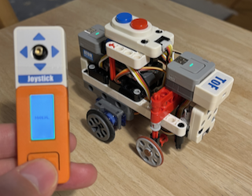

# ego

An M5 powered LEGO robot

## About

Ego is a little robot build from LEGO parts (especially LEGO Technic parts) using [M5Stack](https://m5stack.com) sensors, motors and compute units.
  

The robot can either be **remote controlled** from a M5StickC with the Joystick HAT or it can **drive autonomously** by using the ToF Laser HAT.

The full setup consists of:

- 1 M5StickC
- 1 Joystick HAT
- 1 ATOM Motion Kit
- 1 Servo Kit 360
- 1 ATOM Lite
- 1 ToF HAT
- 2 RGB LED Unit
- 1 Mini Dual Button Unit

## How to build

This project uses PlatformIO which has to be installed and updated first if needed.

Ego consists of 3 nodes (computers) which communicate via WLAN in STA mode. You thus have to correctly configure your WLAN settings in all platformio.ini files of the three subprojects: ego_motion, ego_ranger and ego_remote.

Now you can build and flash the nodes as follows:

- Flash ego_motion on the ATOM Motion node
- Flash ego_ranger on the ATOM Lite node
- Flash ego_remote on the M5StickC

## Usage

Turn on the robot by switching the ATOM Motion switch to on. The two LEDs of the onboard nodes will begin to blink orange until a connection to the configured WLAN can be established.

The LED of the main node will first turn red indicating a stopped state. Later, it will become either green in MANUAL or blue in AUTO mode.
The LED on the node of the ranger unit will show either red, yellow or green depending on how far it can range ahead.

Now turn on your M5StickC. It will first try to connect to your WLAN and indicate this on the LCD screen. It will then transition into a screen which allows you to select either MANUAL or AUTO mode. A single press on the M5StickC button will enter the MANUAL mode - a double press the AUTO mode.

When in **MANUAL mode**, use the joystick to direct the robot. When the robot drives ahead, the front light will shine white and the backlight red. When you drive backwards, the backlight will blink red. Driving left or right will turn on yellow blinker lights on either side of the robot.
To prevent hitting a wall, the range sensor is also active in MANUAL mode and will stop the ego device when it detects an obstacle in proximity (8 cm away or less). Try driving backwards in this case ;-)
To stop the manual mode, either press on the main button or on the button of the Joystick. Note, that the LCD display will dim down after 5 seconds so pressing on the main button will first wake up the display - press again in this case - or use the Joystick button right away.

When in **AUTO mode**, the robot will drive straight ahead until it detects an obstacle less than 30 cm away, in which case it will turn either left or right until it sees enough free space ahead and continues to move in this direction. When it traveled for more than 5 seconds straight, it will remember to toggle the turning direction when it approaches the next near obstacle. 
Stop the AUTO mode again with pressing either the main button of the Stick or the Joystick.

You could activate the two modes also directly on the Robot by pressing the blue button once for MANUAL mode and twice for AUTO mode. Pressing the red button will stop the ego vehicle. The UI on the Stick will then reflect the decisions made by the buttons on the robot.

## Misc

This project uses [proto_activities](https://github.com/frameworklabs/proto_activities) which is a programming concept inspired by the imperative synchronous programming language [Blech](https://www.blech-lang.org).

You can find some more information on the ego project on [this site](https://www.hackster.io/framework-labs/ego-401080) if you want.
